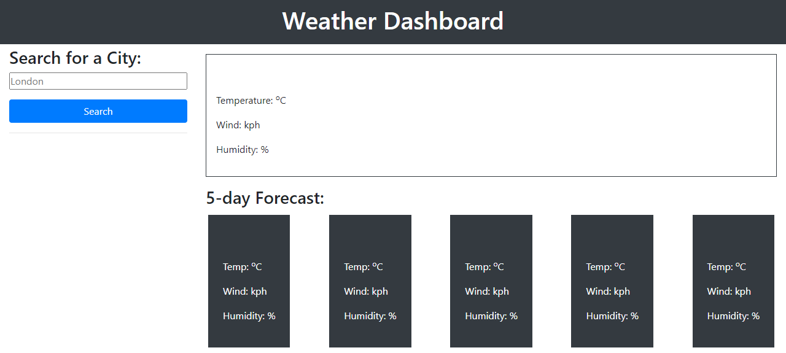
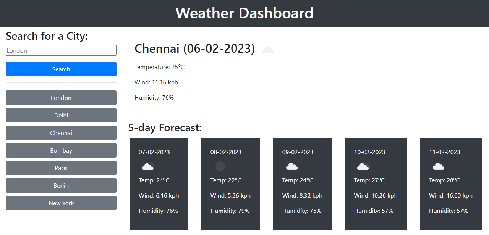

# Travel-Weather-Forecast

## Project Links
Deployed Link: https://github.com/nrprabhav/Travel-Weather-Forecast

Repository Link: https://nrprabhav.github.io/Travel-Weather-Forecast/

## Description
A page that shows the current weather and the five day forecast for a particular place

## Features of the page
A weather display is shown when the page is opened. The features of the page are:
1. Current weather is displayed on the top of the screen
2. Weather forecast for the next five days are displayed below with one card for each day.
3. A form allows user to type in the place for which the weather is desired
4. When a place is submitted the weather for that place is displayed
5. The weather data is requested from the Open weather map API service
6. The place is added to the history below the form
7. The history persists when the page is closed and opened
8. If same place is submitted again, it is not added to the history
9. Program will not respond if the place name is blank
10. If the first letter of the place name is not capitalized, it is automatically capitalized
11. When one of the places in the history is clicked, the weather for that place is displayed

## Screenshots

### Blank Screen

### Weather forecast for a place and some history
